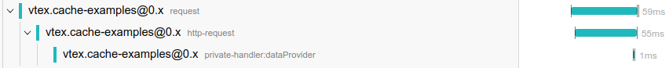
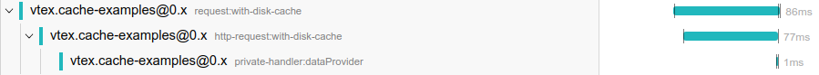

# Distributed Tracing

**Distributed Tracing is only available internally**

`@vtex/api` provides out-of-the-box distributed tracing instrumentation. For more information on how
to use it or how to instrument your app with more granularity check the
[VTEX IO Tracing Guide](https://github.com/vtex/vtex-io-tracing-guide). **Notice, before
instrumenting your application, that the native instrumentation granularity is enough in most of the
cases.**

This documentation will approach details on the native instrumentation provided.

**Table of Contents**

- [Span Tags](#span-tags)
- [Native instrumentation](#native-instrumentation)
  - [Entrypoint Span](#entrypoint-span)
  - [Process Tags](#process-tags)
  - [Client HTTP(S) calls](#client-https-calls)
  - [Splunk logs integration](#splunk-logs-integration)
- [Manual Instrumentation](#manual-instrumentation)

## Span Tags

All Tags exported for your manual instrumentation or used by the native instrumentation are
available and documented in [this file](../src/tracing/Tags.ts).

Note that the tags specified in the
[OpenTracing Semantic Convention](https://github.com/opentracing/specification/blob/master/semantic_conventions.md)
are reexported in this file - the documentation for these tags is available
[here](https://github.com/opentracing/specification/blob/master/semantic_conventions.md).

## Native instrumentation

### Entrypoint Span

The native instrumentation creates an entrypoint span for each incoming request on the app - the
span will start first thing when the request is processed by Koa and will finish when the response
has finished streaming.

The entrypoint span has tags assigned related to the incoming request (more details on the meaning
of each tag on [Tags.ts](../src/tracing/Tags.ts) and
[OpenTracing Semantic Convention](https://github.com/opentracing/specification/blob/master/semantic_conventions.md):

- span.kind
- http.url
- http.method
- http.path
- http.status_code
- vtex.request_id
- vtex.incoming.workspace
- vtex.incoming.account

This span may have an error associated with it, so it can have additional error tags and logs. Also,
the entrypoint span logs the incoming request headers and the outgoing response headers.

### Process Tags

The additional process tags created by the native instrumentation are:

- app.linked
- app.node_vtex_api_version
- app.production
- app.region
- app.version
- app.workspace
- app.node_env

All are documented on [Tags.ts](../src/tracing/Tags.ts).

### Client HTTP(S) calls

Every IOClient http(s) request is natively instrumented with tracing.

The native instrumentation creates, for each client request, a span wrapping the client's
middlewares and one span for each HTTP request made (there can be retries). For example:



The span named `request` wraps the client's middlewares, and the `http-request` child span wraps the
http request. There may be retries due to failures, then the format would be something like:


But again each http request made is wrapped by one `http-request` child span. The native
instrumentation provides an option to add a suffix to these span names, resulting in
`request:suffix-provided` and `http-request:suffix-provided`:



Each `http-request` represents the entire duration of the request, except when the request is
streaming, in this case this span is finished when the underlying http client implementation -
`axios` - finishes preparing the incoming data stream.

A `request` span (wrapping the client's middlewares) has the following tags:

- http.cache.memoization.enabled
- http.cache.disk.enabled
- http.cache.memory.enabled
- http.client.name
- http.url
- http.method

Depending on the caching strategies enabled then the following tags may be defined:

- http.cache.memory
- http.cache.memoization
- http.cache.disk
- http.cache.router

In case of success the following will be set:

- http.status_code

In case the request couldn't be completed due to client errors, like timeouts, the following tag
will be set to true:

- http.no_response

Now about a `http-request` span, it has the following tags:

- span.kind
- http.method
- http.url

And may have the following as well:

- http.status_code
- http.router_cache

In case of a client error:

- http.no_response

Every `http-request` span logs the outgoing request headers and incoming response headers.

These spans (`http-request` or `request`) may have an error associated with them, so they can have
additional error tags and logs.

For more information on each tag check [Tags.ts](../src/tracing/Tags.ts).

### Splunk logs integration

Logs to splunk done via a `Logger` instance are annotated with a `traceId` field if the ongoing trace
was chosen to be sampled. That way we can query for logs on splunk with a trace associated with it:

```
index=io_vtex_logs your-query-goes-here traceId!=NULL
```

The results will have the `traceId` field, which we can use to find the trace associated with it.

## Manual Instrumentation

If you want to have a more granular view on the traces involving your app, you can do a manual
instrumentation for distributed tracing.

All route and event handlers for your app will have a `tracer` field on the `IOContext` provided,
with which you can create spans for your manual instrumentation. The `tracer` object is a wrapper for
the `OpenTracing` tracer, and it's implemented [here](../src/tracing/UserLandTracer.ts), by the
`UserLandTracer` class.

For a detailed tutorial on how to instrument your app read the docs on
[VTEX IO Distributed Tracing Guide](https://github.com/vtex/vtex-io-tracing-guide).
