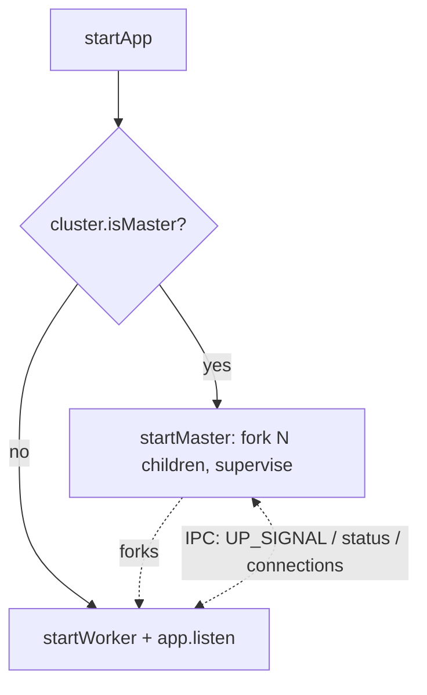
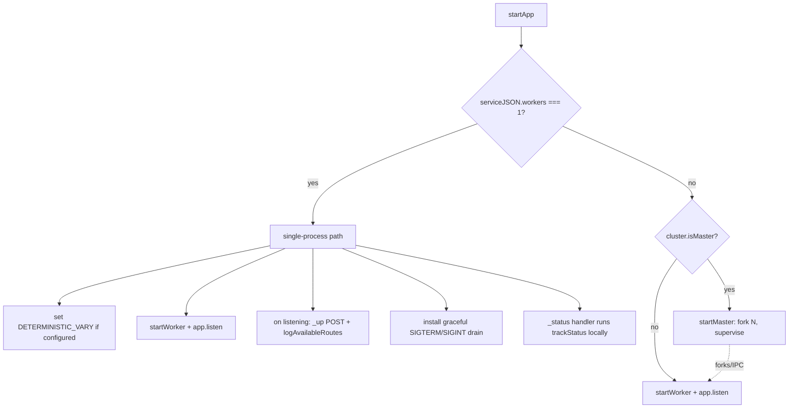

# Single-Process Mode for Single-Worker Services

> **Status**: Draft
> **Created**: 2026-06-16

## 1. Business Context

### Problem Statement

`@vtex/api` boots every service through Node's `cluster` module. `startApp` (`src/service/index.ts:24`) unconditionally branches on `cluster.isMaster`: the initial process becomes a **master** that forks children, and HTTP traffic is only ever served by a forked **worker**. `startMaster` (`src/service/master.ts:89-91`) always forks at least one child, because the resolved worker count is never below 1.

The consequence is that **even when a service runs a single worker, it pays for two processes plus the cluster IPC layer**:

- The master process is dead weight in this case — there is nothing to load-balance across a single worker, yet it still holds its own V8 heap/RSS and sits on the connection-accept path, distributing sockets to the one worker over IPC.
- The default worker count is `os.cpus().length` capped at `MAX_WORKERS = 4` (`src/service/loaders.ts:19-29`, `src/constants.ts:164`). `os.cpus().length` reports the **host node's** CPU count, not the pod's cgroup quota, so a CPU-limited pod on a large node can fork up to 4 workers + 1 master regardless of its real CPU allotment.

This matters because `@vtex/api` is injected into **all** VTEX IO applications. The fixed "master + at least one worker" tax is multiplied across every app and every replica. As described in [Platformatic's Kubernetes benchmark](https://blog.platformatic.dev/93-faster-nextjs-in-your-kubernetes), the cluster master's accept-and-forward-over-IPC coordination layer adds measurable overhead and latency, and forking workers inside CPU-constrained containers is expensive. VTEX IO already scales horizontally via replicas (`minReplicas`/`maxReplicas` in `service.json`), so in-pod clustering is largely redundant with how the platform scales.

This specification defines **single-process mode**: when the resolved worker count is exactly `1`, the SDK runs the HTTP server directly in the main process and skips the `cluster` layer entirely — **no master, no `fork()`, no IPC connection forwarding**. It does not change the default worker count and does not touch multi-worker behavior; those are addressed by separate, complementary efforts described under [Alternatives Considered](#alternatives-considered) and [Out of Scope](#out-of-scope).

### Goals

- When the resolved worker count is `1`, run the service in a **single process** with **no `cluster` master, no `fork()`, and no IPC connection forwarding**.
- Reduce per-replica process count from 2 (master + worker) to 1 for every single-worker service, cutting baseline memory (one fewer V8 heap) and removing the IPC accept/distribute hop.
- Preserve **100% of externally observable runtime behavior** for single-worker services: graceful shutdown semantics, the readiness/`_up` handshake, status-track endpoint, `DETERMINISTIC_VARY`, and linked-mode debugging.
- Leave multi-worker services (`workers > 1`) completely unchanged.

### User Stories

#### US-1: Single-worker service runs as one process

- **Story**: As a VTEX IO application owner whose service resolves to one worker, I want it to run as a single process, so that I stop paying for an idle master process and the IPC layer on every replica.
- **Acceptance Criteria**:
  - **Given** a service whose resolved worker count is `1`, **when** it starts, **then** exactly one Node process exists (no master, no forked child) and it listens on `HTTP_SERVER_PORT`.
  - **Given** the single-process service is running, **when** a request hits any registered public, private, GraphQL, event, or built-in route, **then** it is handled identically to the previous worker process.
  - **Given** the single-process service has started, **when** the server begins listening, **then** the readiness `_up` POST is sent and available routes are logged exactly as before.

#### US-2: Multi-worker services are unaffected

- **Story**: As an application owner who explicitly sets `workers > 1`, I want the existing cluster behavior preserved, so that nothing regresses for services that deliberately use multiple workers.
- **Acceptance Criteria**:
  - **Given** a service whose resolved worker count is greater than `1`, **when** it starts, **then** the current master + N workers cluster topology is used, unchanged.
  - **Given** a multi-worker service, **when** a worker dies unexpectedly, **then** the master still replaces it via `cluster.fork()` as today.

#### US-3: Graceful shutdown is preserved in single-process mode

- **Story**: As a platform operator, I want single-process services to drain in-flight requests on shutdown, so that deploys and rescheduling do not drop traffic any more than they do today.
- **Acceptance Criteria**:
  - **Given** a running single-process service, **when** it receives `SIGTERM`, **then** it stops accepting new connections, allows in-flight requests to finish up to the configured graceful timeout, and then exits with the signal's exit code.
  - **Given** a running single-process service, **when** the graceful timeout elapses before in-flight requests finish, **then** the process force-exits, matching the master's force-kill behavior today.
  - **Given** a running single-process service, **when** it receives `SIGINT`, **then** it shuts down using the short SIGINT timeout, consistent with current master behavior.

#### US-4: Linked/dev mode runs single process and stays debuggable

- **Story**: As a developer running an app linked locally (which forces one worker), I want it to run as a single debuggable process, so that debugging is simpler and consistent with production single-worker behavior.
- **Acceptance Criteria**:
  - **Given** `LINKED` mode (worker count forced to `1`), **when** the app starts, **then** it runs as a single process with no fork.
  - **Given** `LINKED` mode with the inspector enabled, **when** a debugger attaches, **then** it attaches to the main process and breakpoints in handler code are hit.
  - **Given** `LINKED` mode, **when** the `_status` endpoint is called, **then** status tracking executes locally without relying on IPC.

### Key Scenarios

| Scenario | Pre-conditions | Steps | Expected Result |
|---|---|---|---|
| Happy path — single worker | Service resolves to 1 worker (single-CPU pod, explicit `workers: 1`, or `LINKED`) | App boots → server listens → traffic flows → `SIGTERM` | One process only; routes served identically; `_up` sent; graceful drain then exit |
| Happy path — multi worker | Service resolves to `workers > 1` | App boots | Unchanged master + N workers cluster; worker death triggers re-fork |
| Error case — unhandled crash in single process | Single-process service running | Handler throws an `uncaughtException` | Process logs and exits (per `addProcessListeners`); Kubernetes restarts the container (no in-pod re-fork, by design). Recovery-latency trade-off vs cluster re-fork is analyzed in Decision 4 |
| Edge case — `_status` in single process | Single-process service running | `GET /_status` is called | `trackStatus()` runs in-process; no `process.send` IPC broadcast is attempted (no master to receive it) |
| Edge case — readiness consumer absent | Single-process service running | Server starts and posts `_up` to the local readiness port | Behaves exactly as the worker did before; failure to deliver `_up` is handled no worse than today |

### Functional Requirements

- FR-1: The bootstrap MUST detect when the resolved worker count equals `1` and, in that case, run the HTTP server in the current (main) process without invoking `cluster.fork()` or `cluster.isMaster` branching that forks.
- FR-2: When the resolved worker count is greater than `1`, the bootstrap MUST use the existing master/worker cluster path with no behavioral change.
- FR-3: In single-process mode, the system MUST perform every responsibility currently owned by the master for a single-worker topology:
  - FR-3a: Apply `DETERMINISTIC_VARY` env setup when `service.deterministicVary` is true (`master.ts:76-78`).
  - FR-3b: Perform graceful shutdown on `SIGTERM`/`SIGINT` with the configured timeouts (`master.ts:53-99`), including the force-exit fallback.
  - FR-3c: Trigger the readiness handshake — the `_up` POST and `logAvailableRoutes` currently driven by `UP_SIGNAL` (`master.ts:48-50`, `src/service/worker/index.ts:54-78`) — once the server is listening.
  - FR-3d: Handle the `_status` endpoint locally by invoking `trackStatus()` directly, instead of the IPC `BROADCAST_STATUS_TRACK` round-trip (`statusTrack.ts:27-48`, `master.ts:15-17`).
  - FR-3e: Enable inspector/debugging against the main process in `LINKED` mode, replacing the `cluster.setupMaster({ inspectPort })` indirection (`master.ts:81-83`).
- FR-4: Single-process mode MUST NOT attempt to restart itself on crash; container/Kubernetes restart is the recovery mechanism (the master's `cluster.on('exit')` re-fork in `master.ts:27-36` does not apply).
- FR-5: The worker's existing process-level listeners (`addProcessListeners`, `src/service/worker/listeners.ts`) MUST remain installed in single-process mode, but MUST NOT conflict with the graceful-shutdown handlers required by FR-3b (the immediate-exit `SIGTERM`/`SIGINT` handlers must not pre-empt the graceful drain).

### Non-Functional Requirements

- **Resource**: For single-worker services, baseline process count drops from 2 to 1, removing one V8 heap and the IPC accept/distribute path. No measurable latency regression for request handling.
- **Compatibility**: No changes to `service.json` schema, public SDK exports, route registration, middleware order, metrics, tracing, or logging output. `startApp` remains the single entry point.
- **Reliability**: Shutdown drain semantics must be at least as safe as today for single-worker services — no increase in dropped in-flight requests on deploy/rescheduling.
- **Observability**: Startup, readiness, and status-track log lines must remain present and recognizable to existing tooling.

### Out of Scope

- **Changing the default worker count** (e.g. defaulting `workers` to 1, or making it cgroup-aware). This is a separate, complementary effort and is explicitly deferred; this spec leaves `getWorkers` untouched.
- **Replacing `cluster` with `SO_REUSEPORT`/kernel-level connection distribution** for multi-worker services. This is a larger, higher-risk redesign and is explicitly deferred.
- Any feature flag / env gate for the new path. Per decision, single-process mode is **unconditional** when the resolved worker count is `1`.
- Sharing client caches across workers, or changing `scaleClientCaches` semantics for multi-worker services.
- Modifying how the platform sets `minReplicas`/`maxReplicas` or how it scales replicas.

---

## 2. Arch Decisions

### Proposed Solution

Introduce a branch in the bootstrap that selects between **single-process mode** and the existing **cluster mode** based on the resolved worker count from `getServiceJSON()`:

- If `serviceJSON.workers === 1` → run a new **single-process** path that starts the worker app in the current process, listens, and assumes the subset of master responsibilities that still apply to one process (graceful shutdown, readiness handshake, local status-track, linked debugging, `DETERMINISTIC_VARY`). No `cluster.fork()` is called.
- Otherwise (`workers > 1`) → keep today's `cluster.isMaster ? startMaster : startWorker` flow verbatim.

The decision is made **before** any cluster branching, since the resolved worker count is already known at `startApp` time via `getServiceJSON()` (`loaders.ts:31-37`). Because `getWorkers` forces `1` under `LINKED` (`loaders.ts:22-24`), linked/dev runs naturally take the single-process path.

### Architecture Overview

Current bootstrap (always clustered):

Proposed bootstrap (branch on resolved worker count):

Mapping of master responsibilities to the single-process path:

| Master responsibility (cluster mode) | Source | Single-process handling |
|---|---|---|
| Fork N workers | `master.ts:89-91` | Not needed — run in current process |
| Re-fork on worker death | `master.ts:27-36` | Dropped — container/k8s restarts |
| `UP_SIGNAL` → first worker readiness | `master.ts:45-51` | Trigger `_up` POST + `logAvailableRoutes` after `listen` |
| Status-track broadcast over IPC | `master.ts:15-17`, `statusTrack.ts:46-48` | `_status` handler calls `trackStatus()` directly |
| Graceful shutdown + force-kill timeout | `master.ts:53-99` | Install equivalent drain/timeout on the main process |
| `DETERMINISTIC_VARY` env before fork | `master.ts:76-78` | Set in main process before `startWorker` |
| Linked debugger inspect port | `master.ts:81-83` | Debugger attaches to main process directly |

### Alternatives Considered

| Alternative | Pros | Cons | Verdict |
|---|---|---|---|
| **Single-process mode when `workers === 1`** (this spec) | Removes idle master + IPC for the common case; small, contained change; preserves multi-worker behavior | Master lifecycle duties must be relocated into a single-process path; two boot paths to maintain | **Accepted** |
| **Change the default worker count** (flat 1, or cgroup-aware quota detection) | Stops over-forking on large nodes; aligns defaults with replica-based scaling | Behavior/perf change for apps relying on the current `cpus().length` default; orthogonal to removing the idle master | Deferred (separate, complementary spec) |
| **Replace `cluster` with `SO_REUSEPORT`** kernel-level distribution | Removes master/IPC for multi-worker too; matches the article's preferred design | Requires recent Node + Linux ≥3.9; reworks the whole handshake; high risk; redundant with replica-based scaling | Deferred |
| **Gate single-process behind an env flag** | Safer staged rollout | Per decision, rollout is unconditional; adds config surface and a second long-lived code path | Rejected |

### Risks & Mitigations

| Risk | Impact | Likelihood | Mitigation |
|---|---|---|---|
| Graceful shutdown regresses (drops in-flight requests) because the worker's immediate-exit signal handlers (`listeners.ts:43-44`) pre-empt the new drain logic | High | Med | Ensure the single-process path owns `SIGTERM`/`SIGINT` with the master's drain/timeout semantics and that `addProcessListeners` does not register conflicting immediate-exit handlers in this mode |
| `_status` silently stops tracking because `process.send` is undefined without IPC (`statusTrack.ts:30`) | Med | High | `_status` handler must call `trackStatus()` directly in single-process mode rather than relying on the IPC broadcast |
| Readiness `_up` not sent (no master to emit `UP_SIGNAL`), causing the platform to consider the replica not ready | High | Med | Trigger the existing `_up` POST + `logAvailableRoutes` on the `listening` event in single-process mode |
| Linked-mode debugging breaks (inspect port previously set via `cluster.setupMaster`) | Med | Med | Rely on the main process inspector; validate breakpoints attach when linked |
| Slower crash recovery than in-process re-fork: a single-process crash triggers a full container restart (incl. possible CrashLoopBackOff backoff), and the listening socket drops during the gap — whereas the master keeps the port open and queues connections while re-forking | Low | Med | Availability is owned at the replica layer — VTEX IO already deploys `minReplicas ≥ 2` by default, so a single replica restarting is not an outage; sibling replicas keep serving and the readiness probe routes around the restarting replica. Full analysis in Decision 4 |
| Behavior drift between the two boot paths over time | Med | Low | Centralize shared lifecycle logic so both paths invoke the same readiness/shutdown helpers where possible |

### Key Decisions

#### Decision 1: Trigger single-process mode strictly when resolved `workers === 1`

- **Status**: Accepted
- **Context**: Single-process mode targets the case where clustering provides no benefit. The resolved worker count from `getServiceJSON()` already accounts for the `LINKED` override and the `MAX_WORKERS` cap.
- **Decision**: Branch on `serviceJSON.workers === 1`. The default worker count logic (`getWorkers`) is left untouched, so multi-CPU production pods that rely on the `cpus().length` default continue to cluster.
- **Consequences**: Only services that already resolve to one worker change behavior. The default-count problem (host vs. cgroup CPUs) is intentionally left to the separate "change the default worker count" effort.

#### Decision 2: Single-process mode is unconditional (no flag)

- **Status**: Accepted
- **Context**: A flag would allow staged rollout but adds config surface and keeps two long-lived paths diverging.
- **Decision**: When `workers === 1`, always use single-process mode; no opt-in or opt-out env var.
- **Consequences**: Behavior changes reach all single-worker services on upgrade. Correctness of the relocated lifecycle duties (shutdown, readiness, status) is therefore release-critical and must be covered before shipping.

#### Decision 3: Apply single-process mode in `LINKED`/dev mode too

- **Status**: Accepted
- **Context**: `getWorkers` forces `1` under `LINKED`. Today linked mode still forks and uses `cluster.setupMaster({ inspectPort })` for debugging.
- **Decision**: Linked mode runs single-process; the debugger attaches to the main process directly, removing the cluster inspect-port indirection.
- **Consequences**: Simpler, more consistent local debugging. The `cluster.setupMaster` inspect-port path is no longer exercised in linked mode and must be validated to not break breakpoint attachment.

#### Decision 4: Rely on container/orchestrator restart instead of in-process re-fork on crash

- **Status**: Accepted
- **Context**: In cluster mode the master re-forks dead workers via `cluster.on('exit')` (`master.ts:27-36`): when the lone worker crashes, a replacement is spawned inside the already-running container in roughly app-boot time. In single-process mode there is no master, so a crash exits the container and recovery falls to the orchestrator's restart policy. A fair decision must weigh **recovery latency** and **availability during recovery**, not just code simplicity — re-forking a process is meaningfully faster than a full container restart.
- **Recovery comparison** (single-worker case):

| Aspect | Cluster re-fork (today) | Single-process + container restart (proposed) |
|---|---|---|
| Recovery latency for the replica | Fast: `cluster.fork()` + app boot, no container teardown | Slower: container exit → kubelet restart → Node cold start + app boot; repeated crashes hit CrashLoopBackOff (≈10s→…→5min cap) |
| Listening socket during the gap | Master holds the port and queues incoming connections until the new worker is online → clients see latency, not refusal | Socket closes on crash → new connections to that replica are refused until the container re-binds |
| Concurrent-worker availability during the gap | None — a single worker means zero workers serve during the gap regardless | None — same |
| OOMKilled / liveness-probe failure / master crash | Not covered — orchestrator restarts the container anyway | Same |
| Hot crash-loop behavior | Master re-forks with no backoff (can busy-loop crashing) | Orchestrator applies backoff (dampens busy crash loops) |

- **Decision**: Accept orchestrator restart as the recovery mechanism for single-process services. On fatal error the process exits (existing `addProcessListeners` behavior, e.g. `process.exit(420)` on `uncaughtException`) and the container is restarted.
- **Rationale**: For a single-worker service the master's re-fork gives **no concurrent-worker availability** during a crash — the replica is unavailable either way while a new process boots. The only genuine edge cluster mode held is the master keeping the socket open to queue connections during the short re-fork window. That edge is outweighed because **availability is owned at the replica layer**: VTEX IO already deploys `minReplicas ≥ 2` by default, so while one replica restarts its siblings keep serving and the readiness probe removes the restarting replica from rotation. Orchestrator backoff also dampens hot crash loops (the master re-forks with none), and the failure modes the master cannot recover from (OOM, liveness failure, master crash itself) already depend on container restart today.
- **Consequences**: A crashing single-worker replica is out of rotation for one container-restart cycle instead of one in-process re-fork cycle, and connections to it are refused (not queued) during that window. Because of the default `minReplicas ≥ 2` topology this is not a service outage, but the per-replica recovery window is longer; worth noting in upgrade guidance. Captured in the Risks table.
- **Recovery under load — re-fork can amplify, single-process sheds**: the "master queues connections during the gap" behavior is a double-edged sword, and which edge dominates depends on *why* the worker died.
  - In cluster round-robin mode the master owns the listening socket and, while the lone worker is dead, keeps `accept()`-ing and pushing **connection handles** onto an **unbounded, backpressure-free queue** (`RoundRobinHandle`). On re-fork it drains that queue onto the fresh worker as fast as the worker pulls connections.
  - **Load-induced crash (OOM, event-loop saturation, poison-pill at volume):** this queuing creates a degradation loop. The new worker boots cold (cold V8/JIT, cold caches sized by `scaleClientCaches`, cold upstream pools) and is immediately flooded with the accumulated backlog — much of it already past client timeouts (wasted work) and compounded by client/LB retries — so the original load condition recurs and it crashes again. Combined with the master's **zero-backoff** re-fork, this runs at full speed. Single-process mode **breaks this loop**: the socket closes, load is **shed** (connection-refused) rather than absorbed, sibling replicas (`minReplicas ≥ 2`) serve the traffic, the readiness gate re-admits the replica gradually, and CrashLoopBackOff spaces restarts so the system can settle. Here single-process is **more resilient**, not just slower.
  - **Transient/non-load crash (one-off bug on a specific input):** here cluster mode's queue-and-fast-refork is gentler — clients see a brief latency bump instead of connection-refused, and there is no loop because the crash is not load-correlated. This is the genuine edge cluster mode retains.
  - **Net**: cluster re-fork wins for rare transient crashes; single-process shed-and-reroute wins for load-correlated crashes — and only the latter produces a self-amplifying degradation loop, so avoiding absorb-and-concentrate is the safer default for an SDK running in every app.

### Implementation Plan

1. **Branch the bootstrap** in `startApp` (`src/service/index.ts`) on `serviceJSON.workers === 1`, routing to a new single-process entry while leaving the existing `cluster.isMaster` path for `workers > 1`.
2. **Build the single-process entry** that: sets `DETERMINISTIC_VARY` when configured, calls `startWorker(serviceJSON)`, listens on `HTTP_SERVER_PORT`, and on `listening` performs the readiness handshake (`_up` POST + `logAvailableRoutes`).
3. **Relocate graceful shutdown** — extract the master's drain/timeout logic (`master.ts:53-99`) into a reusable helper and install it on the main process in single-process mode, ensuring it is not undercut by the immediate-exit handlers in `listeners.ts`.
4. **Make `_status` mode-aware** — when there is no IPC master (single-process), the `/_status` handler invokes `trackStatus()` directly instead of `process.send(BROADCAST_STATUS_TRACK)`.
5. **Linked debugging** — confirm the inspector attaches to the main process; remove reliance on `cluster.setupMaster` for the single-process/linked path.
6. **Validation** — verify single-process boot, request handling across all route types, readiness signal, `_status`, graceful drain on `SIGTERM`/`SIGINT`, and that `workers > 1` remains byte-for-byte the old behavior.

---

## 3. Technical Contract

### Data Models

No new persistent data models. The decision input is the already-resolved service descriptor:

- `ServiceJSON` (`src/service/worker/runtime/typings.ts:203-205`) — extends `RawServiceJSON` with a non-optional `workers: number`. The value of `workers` is the single decision input; `1` selects single-process mode.

No changes to `RawServiceJSON` or the `service.json` schema.

### Interfaces

- **Entry point (unchanged signature)**: `startApp(): Promise<void>` (`src/service/index.ts:10`). Internally gains a branch: `serviceJSON.workers === 1` → single-process path; otherwise the existing master/worker path.
- **New internal single-process entry** (illustrative; exact name/shape at implementation time):
  - `startSingleProcess(service: ServiceJSON): Promise<void>` — sets `DETERMINISTIC_VARY` if `service.deterministicVary`, calls `startWorker(service)`, listens on `HTTP_SERVER_PORT`, runs the readiness handshake on `listening`, and installs graceful shutdown.
- **Existing reused interfaces**:
  - `startWorker(serviceJSON: ServiceJSON): Koa` (`src/service/worker/index.ts:217`) — reused unchanged to build the app.
  - `getServiceJSON(): ServiceJSON` (`src/service/loaders.ts:31`) — provides the resolved worker count.
  - Readiness: the `_up` POST currently in `upSignal()` and `logAvailableRoutes(service)` (`src/service/worker/index.ts:54-78`) — invoked directly after `listen` instead of via the `UP_SIGNAL` IPC message.
  - Graceful shutdown: the drain/timeout currently in `handleSignal` (`src/service/master.ts:56-71`) — extracted into a helper usable by both paths; timeouts `GRACEFULLY_SHUTDOWN_TIMEOUT_S` and `SIGINT_TIMEOUT_S` are reused.
  - Status track: `trackStatus()` (`src/service/worker/runtime/statusTrack.ts:36-44`) — invoked directly by the `_status` handler in single-process mode; `broadcastStatusTrack()` (IPC) is bypassed.

### Integration Points

- **Process/runtime**: Node `cluster` module is *not* engaged in single-process mode (no `isMaster` fork branch, no `fork()`, no IPC channel). The Koa `app.listen(HTTP_SERVER_PORT)` is the only listening socket.
- **Platform readiness consumer**: the `_up` POST to the local readiness port (as in `upSignal()`, `src/service/worker/index.ts:54-71`) must still be emitted so the platform marks the replica ready.
- **Signals from orchestrator**: `SIGTERM` (deploy/reschedule) and `SIGINT` are handled directly by the main process with the existing timeout semantics.
- **Inspector/debugger**: in `LINKED` mode the debugger attaches to the main process; the `cluster.setupMaster({ inspectPort: INSPECT_DEBUGGER_PORT })` indirection (`master.ts:81-83`) is not used on this path.
- **Unchanged integrations**: telemetry/metrics (`global.metrics`, `global.diagnosticsMetrics`), tracing, logging, route/middleware composition in `startWorker` — all identical to today.

### Invariants & Constraints

- **INV-1**: For any service, exactly one of the two paths runs: single-process iff `serviceJSON.workers === 1`; cluster (master + N workers) iff `serviceJSON.workers > 1`.
- **INV-2**: In single-process mode there is exactly one Node process and no child processes are forked.
- **INV-3**: For `workers > 1`, runtime topology and behavior are unchanged from the current implementation.
- **INV-4**: Every master responsibility that has an observable effect for a single-worker service (readiness `_up`, graceful drain with force-exit timeout, `_status` tracking, `DETERMINISTIC_VARY`, linked debugging) is preserved in single-process mode.
- **INV-5**: `process.send`-based IPC messaging is never invoked in single-process mode (there is no parent channel); any logic that previously depended on it must have a direct in-process equivalent.
- **INV-6**: The public SDK surface (`startApp`, `appPath`, exported types) and the `service.json` schema are unchanged.
